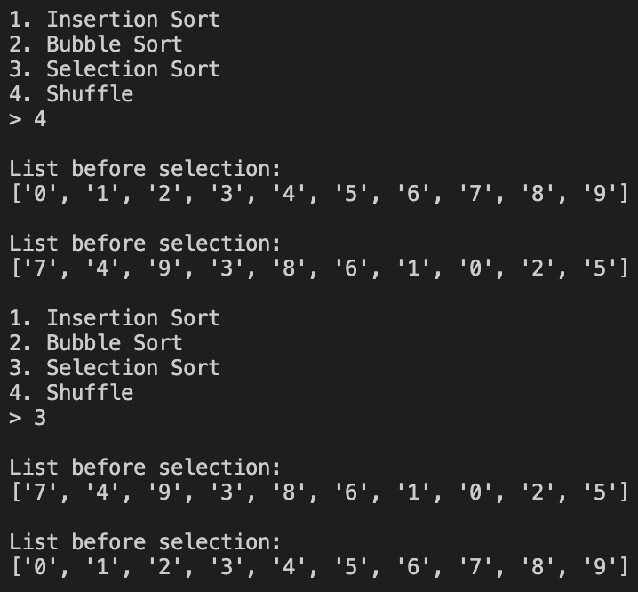

# Description
 This program allows users to enter information into a list and uses various sorts to sort the list. There is also an option to shuffle the list. The sorts the program uses is insertion sort, bubble sort, insulation short.

# Development Environment
* Visual Studio Code
* Python 3.8.5

# Execution
To execute the program: `Python3 main.py`
 
or
 
click "run" button

user can enter number into list 

user can shuffle list and uses insertion sort to sort it 

user can shuffle list and uses bubble sort to sort it 

user can shuffle list and uses selection sort to sort it 

# Useful Sites
* [Insertion sort Wiki](https://en.wikipedia.org/wiki/Insertion_sort)
* [Bubble sort Wiki](https://en.wikipedia.org/wiki/Bubble_sort)
* [Selection sort Wiki](https://en.wikipedia.org/wiki/Selection_sort)
* [Stack Overflow](https://stackoverflow.com)
* [Automate the Boring Stuff with Python](https://automatetheboringstuff.com/2e/chapter9/)